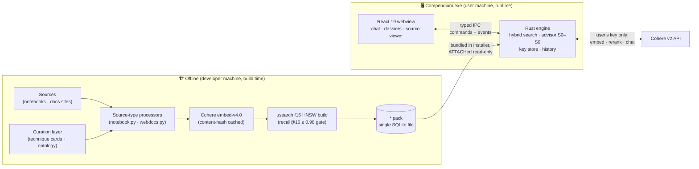
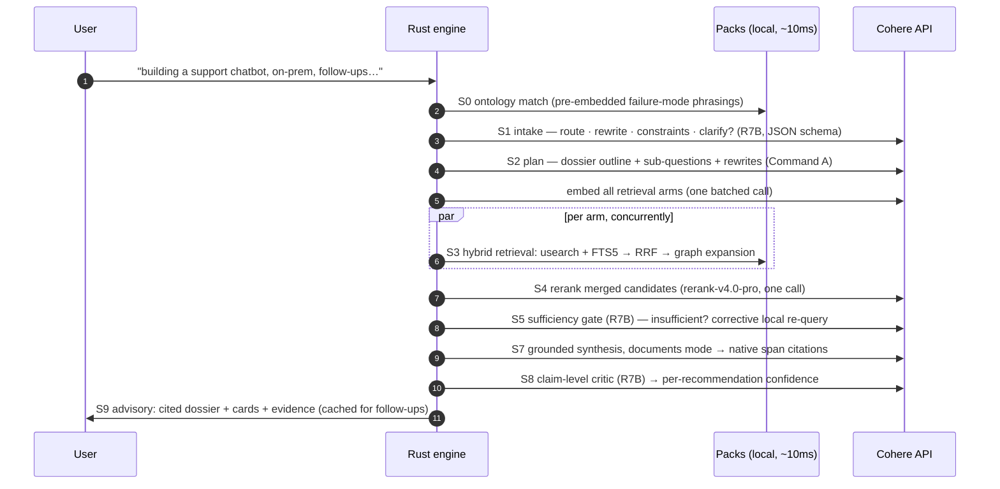
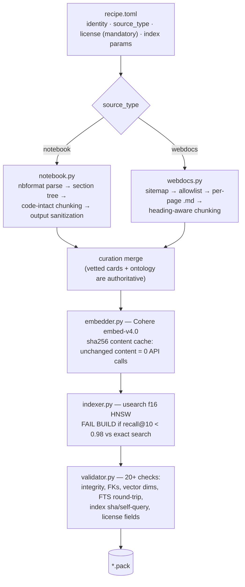

<div align="center">


# Compendium

**Describe the problem you're facing. Get the best-fit techniques — with receipts.**

A Windows desktop advisor that reasons over curated, offline-built knowledge packs and
answers with cited, exportable knowledge dossiers.

[](https://github.com/AkshitIreddy/compendium/releases/tag/v0.1.0)
[](https://github.com/AkshitIreddy/compendium/releases)
[](#-license--attribution)
[](https://tauri.app)
[](app/src-tauri)
[](app/src)
[](pipeline)

[Install](#-installation) · [How it works](#-how-it-works) · [Architecture](#-architecture) ·
[The advisor pipeline](#-the-advisor-pipeline) · [Pack format](#-knowledge-pack-format) ·
[Build pipeline](#-the-offline-build-pipeline) · [Contributing](docs/CONTRIBUTING.md)

</div>

---

## 💡 What is Compendium?

Compendium is a desktop advisor that already read the material you haven't had time to —
44 technique notebooks, three sets of framework docs — and recommends **what to use for
your situation**. It handles two kinds of questions, and both are first-class:

**"I'm planning something — what should I use?"** Describe your use case and its
constraints in plain English: *"I'm building a RAG assistant over 10,000 legal PDFs;
every answer must cite exact clauses, and data can't leave our infrastructure."*
Compendium recommends a concrete approach — which techniques, how they fit together,
what each one costs you — tied to each requirement you stated.

**"Something's wrong — how do I fix it?"** Describe the symptom: *"My retriever finds
chunks with the right keywords, but the answers keep missing the point."* Compendium
diagnoses it against a curated [failure-mode taxonomy](#g-ontology) and recommends the fixes.

Either way — one line or a full page of context — it answers with:

- **Best-fit techniques**, ranked with per-problem justification and a confidence meter
- **[Span-accurate citations](#g-span-citation)** — click any highlighted claim to open the exact notebook
  cells or docs section that back it, rendered beautifully in-app
- **Honest tradeoffs and gaps** — it tells you what each fix costs, and says plainly when
  its knowledge doesn't cover your case
- **A one-click [dossier](#g-dossier) export** — a self-contained markdown bundle (recommendations,
  cited prose, verbatim evidence appendix) built to be pasted into any other AI as
  grounding for implementing the fix

The knowledge is **curated, not crowdsourced**: packs are prepared, vetted, and embedded
offline by a build pipeline, then shipped read-only inside the installer. Your machine
never embeds corpus content — at runtime the app only processes *your* queries, using
*your own* Cohere API key (the free trial tier is enough for ~100+ advisories a month).

### What ships in v1

| Pack | Contents |
|---|---|
| 📚 **RAG Techniques** | 39 techniques + 5 evaluation methodologies from [NirDiamant/RAG_Techniques](https://github.com/NirDiamant/RAG_Techniques), analyzed into structured cards with a 25-failure-mode ontology and a typed relation graph |
| 📖 **Framework Docs** | 155 pages of current LangChain, LangGraph, and LangSmith documentation, scoped to retrieval, agentic RAG, memory, evaluation, observability, and prompt engineering |

New subject areas arrive as new packs — the core is entirely pack-agnostic.

---

## 📦 Installation

1. **Download** [`Compendium_0.1.0_x64-setup.exe`](https://github.com/AkshitIreddy/compendium/releases/tag/v0.1.0) (~18 MB — both knowledge packs included).
2. **Run it.** Windows SmartScreen will warn once because the installer is unsigned —
   click *More info → Run anyway*. It installs per-user via [NSIS](#g-nsis) (no admin prompt) and takes
   seconds.
3. **Add your Cohere key** when the app asks. Get a free one at
   [dashboard.cohere.com/api-keys](https://dashboard.cohere.com/api-keys) — the trial
   tier covers roughly 100+ Balanced-depth advisories per month. The key is stored in the
   **Windows Credential Manager**, never in a file, and never leaves your machine except
   to call Cohere.
4. **Ask something.** Try one of the example prompts on the empty screen, or describe
   your actual problem.

> **No key? No problem.** Compendium still works in *local match mode*: ranked technique
> suggestions from the on-device index (keyword + ontology matching), with full source
> browsing. You just won't get the LLM-written advisory prose.

### Everyday use

- **[Depth tiers](#g-tier)** — pick per question in the composer: **Quick** (~3 API calls),
  **Balanced** (~7, the default), **Deep** (~12+, adds corrective retrieval loops and
  per-section verification). A usage meter in Settings tracks your monthly calls.
- **Citations** — highlighted spans in the answer are clickable; the source panel opens
  the exact notebook cells or docs heading, with provenance and a link to the original.
- **Follow-ups** — the conversation has real memory. "What about the second option?" or
  "we can't re-index, does that change things?" just work.
- **Export** — *Copy dossier for another AI* puts a complete, cited, self-contained
  markdown bundle on your clipboard.
- **Make it yours** — Settings (the gear button, or `Ctrl+,`): four themes + system, any
  accent hue (contrast-safe by construction), density, text scale, motion intensity,
  optional UI sounds. Everything applies live. `Ctrl+K` opens the command palette.

---

<div align="center">

## 🔬 For developers: the deep end starts here

*Everything below is implementation detail — how the engine, packs, pipeline, and UI
actually work, with real code from the repo. Linked terms like [RRF](#g-rrf) jump to the
[glossary](#-glossary).*

</div>

---

## 🗺 How it works

The system is three programs sharing one contract (the pack format):



Three invariants hold everywhere:

1. **[Packs](#g-knowledge-pack) are read-only forever.** User data lives in a separate WAL database; upgrading
   a pack means replacing a file.
2. **The corpus is never [embedded](#g-embedding) at runtime.** Only user queries are (with the *same*
   model/dims the pack was built with — enforced at pack load).
3. **No turn is ever lost.** Every API failure — outage, quota, malformed response —
   degrades to a locally-computed advisory instead of an error.

### Repository layout

```
compendium/
├── app/
│   ├── src/                    React 19 UI
│   │   ├── design/             OKLCH token system + WCAG contrast CI
│   │   ├── features/           chat · sources · history · settings · palette
│   │   └── lib/                typed IPC, settings, Shiki, Web Audio
│   └── src-tauri/              Rust engine
│       ├── src/engine/
│       │   ├── pack.rs         pack loading, usearch restore + self-heal
│       │   ├── search.rs       hybrid retrieval: dense + BM25 + RRF + graph
│       │   ├── cohere.rs       typed v2 client, pacing, quota semantics
│       │   ├── advisor/        the S0–S9 pipeline, context manager, export
│       │   ├── appdb.rs        conversations · traces · settings · quota
│       │   └── keys.rs         Windows Credential Manager
│       └── tests/              engine + live-API integration tests
├── pipeline/                   Python pack builder
│   ├── compendium_pack/        recipe → process → embed → index → validate
│   │   └── processors/         notebook.py (reference) · webdocs.py
│   └── packs/                  recipes + curation data per pack
├── docs/                       PLAN.md · PACK_FORMAT.md · CONTRIBUTING.md
└── research/                   Phase-1 corpus analysis + platform reports
```

---

## 🧠 The advisor pipeline

The heart of the app is a **fixed state machine** in
[`engine/advisor/mod.rs`](app/src-tauri/src/engine/advisor/mod.rs) — ten stages, composed
from the best-performing method per stage after a survey of the 2025–26 literature and
production systems ([full survey](research/advisor-pipeline.md)). The LLM plans and
judges *inside* stages; it never invents the pipeline per query.

The design exploits one unusual property: retrieval is **local and ~10 ms**, so the
deep-research pattern (plan → parallel retrieval fan-out → grade → synthesize → verify)
dominates the interleaved agent loops that exist to ration expensive retrieval —
"searchers" here are concurrent Rust functions, not LLM calls.



### Stage by stage — what actually happens to your question

Suppose you type: *"I'm building a support chatbot over our product docs. It has to run
on-prem and handle follow-up questions. What should I use?"* Here is that message's
entire journey.

#### S0 — Ontology match *(local, ~1 ms, no API)*

Before any model is called, your text is compared against a few dozen pre-embedded
**[failure-mode phrasings](#g-ontology)** shipped in the pack — sentences like *"chunks that mention my
keywords outrank the one that actually answers."* [Cosine similarity](#g-cosine) against these plus a
keyword match produces a shortlist of failure modes your message might relate to.

For a **planned use case** like the example, phrasings simply won't match strongly and
this stage contributes nothing — by design. It's a free hint channel for
symptom-shaped questions, not a gate: nothing downstream depends on it matching. When it
*does* fire (a diagnosis question), the techniques known to address those failure modes
get one extra "vote" in retrieval later.

#### S1 — Intake *(1 call, small model)*

One structured-output call to the cheap model (`command-r7b`) reads your message plus
the conversation so far and returns a JSON analysis:

- **[`intent`](#g-intent)** — `build` (you're planning something), `diagnose` (something's broken),
  or `mixed`. This reframes everything downstream: a `build` question gets an
  approach-shaped answer ("Recommended approach / Techniques to use / How they fit
  together"), not a diagnosis-shaped one.
- **`route`** — is this a new request, a follow-up needing fresh retrieval, a follow-up
  about things already presented, an answer to a question the advisor asked, or just
  chit-chat? (Chit-chat never spends API calls — a deterministic pre-filter catches
  "thanks" before S1 even runs.)
- **`standalone_query`** — your message rewritten as one self-contained search query,
  with pronouns resolved from conversation history ("the second one" → the actual
  technique name).
- **`constraints`** — the requirements that change which techniques fit: *on-prem*,
  *must handle follow-ups*, *cannot re-index*, *exact citations required*. For `build`
  intent these **are** the problem statement, so extraction is thorough, and they
  accumulate across the whole conversation.
- **`clarifying_question`** — almost always null. The one case the advisor is allowed
  to ask instead of answer: when your symptom is ambiguous between **opposite
  remedies**. The corpus distinguishes context-*starved* (retrieved fragments are
  missing their surroundings → fix by *expanding* context) from context-*polluted*
  (irrelevant chunks crowd the window → fix by *shrinking* it). Users phrase both as
  "my answers are bad," and a wrong guess recommends the exact opposite of the right
  fix — so the advisor asks one short question.

#### S2 — Planning *(1 call, big model; skipped on Quick)*

The flagship model (`command-a`) turns the analyzed request into a **dossier plan**:

- 3–5 **section titles** specific to your request (for the example: something like
  *"Recommended architecture" / "On-prem model and store choices" / "Handling
  follow-ups" / "How the pieces compose"*),
- 3–6 **sub-questions** — the things the dossier must answer, phrased the way technical
  documentation would phrase them (they become search queries),
- 2–4 **rewrites** of the core request in different vocabulary, to catch corpus content
  that words things differently.

This is the "[multi-query](#g-multi-query)" insight: one embedding of your raw message would find *some*
relevant content; a fan of targeted sub-questions finds the coverage a real answer needs.

#### Embedding the fan *(1 call)*

Every retrieval arm — standalone query, sub-questions, rewrites (plus, on Deep tier,
the names of S0-matched failure modes) — is [embedded](#g-embedding) in **one batched API call**
(`embed-v4.0` accepts up to 96 texts).

#### S3 — Retrieval fan-out *(local, ~10 ms per arm, no API)*

Each arm now searches the packs **concurrently, on-device**. Per arm, per pack:

1. **Dense**: the query vector searches two [usearch](#g-usearch) [HNSW](#g-hnsw) indexes — technique *cards*
   (the recommendation targets) and *chunks* (the evidence).
2. **Sparse**: the same arm, sanitized into an FTS5 `MATCH` expression, runs [BM25](#g-bm25)
   keyword search — catching exact terms, API names, and rare tokens that embeddings
   blur.
3. **Fusion**: the ranked lists merge via [Reciprocal Rank Fusion](#g-rrf) — a rank-based formula
   that needs no score calibration, which matters because cosine scores and BM25 scores
   live on incomparable scales. The S0 ontology shortlist joins as one more ranked list,
   so failure-mode knowledge is literally just *one voice among several*.
4. **Graph expansion**: for the top fused cards, the engine walks the pack's typed
   relation graph one hop — `alternative_to`, `prerequisite_of`, `composes_with` — and
   adds neighbors similarity search under-ranks. This is where "you'll also need a
   reranker before segment extraction" and "X is the managed-service alternative to Y"
   come from.

Results from all arms merge (a chunk found by three different sub-questions is a strong
signal), and exact float32 cosine over the pack's stored vectors re-orders the fused
candidates — fusion *selects*, exact similarity *ranks*.

#### S4 — Rerank & select *(1 call)*

The merged evidence — typically 30–40 chunks — goes to Cohere's [cross-encoder reranker](#g-reranker)
(`rerank-v4.0-pro`) in a single call, scored against your standalone query. A
cross-encoder reads query and document *together*, so it's far more precise than the
embedding similarity that produced the candidates. Then, locally:

- **[Adaptive-k](#g-adaptive-k)**: instead of keeping a fixed top-N, the list is cut at the score
  *cliff* — where relevance drops sharply — so weak evidence never pads the context.
- **Diversity caps**: at most 2–3 chunks per technique, so one well-documented
  technique can't crowd out the comparison the dossier needs.
- **Token budget**: evidence is capped (~14k tokens) so synthesis always has headroom.

#### S5 — The sufficiency gate *(1 call, small model; skipped on Quick)*

Here's a failure mode of naive RAG advisors: retrieved chunks can be *relevant* yet
*insufficient* — on-topic but not actually containing the answer — and language models
confidently hallucinate the gap shut. So before writing anything, one batched call asks
the small model, per sub-question: **is this evidence sufficient to answer it
faithfully?**

For each insufficient verdict, the engine re-queries **locally** (free — retrieval is
on-device) using the grader's "what's missing" description, and adds what it finds. If
coverage is still thin, that sub-question becomes an honest **gaps note** in the final
answer — *"the knowledge packs have thin coverage on X"* — instead of invented prose. (Adapted from [CRAG](#g-crag).)

#### S6 — Evidence assembly *(local)*

The surviving evidence is packaged for the synthesis call: each excerpt gets a stable
citation id (`pack:chunk:187`), a title (`technique — section`), and a position —
strongest material first *and* last ("sandwich" ordering, because models attend least to
the middle of long contexts). The top technique **cards** are included as citable
documents too, so the final answer can cite the curated card, not just raw notebook text.

#### S7 — Grounded synthesis *(1 call, big model; per-section on Deep)*

The flagship model writes the dossier in Cohere's **documents mode**: it can only ground
claims in the documents provided, and the API returns **[character-span citations](#g-span-citation)** —
"characters 210–290 of the answer are supported by `rag-techniques:chunk:187`." That's
what powers click-to-highlight in the UI, with no regex heuristics.

The prompt carries your constraints verbatim, the intent framing, and two rules distilled
from the corpus analysis (where naive advisors reliably go wrong):

- **Tie every recommendation to the specific requirement or symptom it serves** — no
  generic technique dumps.
- **The escalation ladder** — reranking → reliable RAG → CRAG → Self-RAG → agentic RAG
  are alternatives at increasing complexity, *never* stacked together — plus the
  relation notes between candidates ("A is a prerequisite of B") so composition advice
  is graph-informed, not vibes.

#### S8 — Verification *(1 call, small model; skipped on Quick)*

Two layers. First, **zero-cost integrity**: every citation's span is checked against the
answer text and its document id against what was actually sent (anything invalid is
dropped, never rendered). Second, a **claim-level critic**: the small model reads the
finished dossier against the evidence and judges, per recommended technique, whether the
stated fit is actually supported. Each recommendation's **confidence meter** is a blend
of retrieval strength, rerank score, and critic verdict — so a technique that merely
*sounded* right gets visibly lower confidence than one the evidence backs.

#### S9 — Persist & cache *(local)*

The advisory is stored as validated JSON (history re-renders offline, forever), the
evidence pool is cached on the conversation so follow-ups like *"tell me more about the
second one"* reuse it with **zero** new retrieval calls, and a compact trace (route,
queries, retrieval ids, models, latency, validation results) is written for debugging.
Title generation and history summarization happen asynchronously after your answer is
already on screen.

#### Cost summary

| Tier | Stages active | LLM calls | Rerank | Embed |
|---|---|---|---|---|
| **Quick** | S0, S1, S3, S4, S6, S7, S9 | ~2–3 | 1 | 1 |
| **Balanced** *(default)* | everything, once | ~5–7 | 1 | 1 |
| **Deep** | + ontology fan-out arms, corrective re-grading, per-section synthesis and repair | ~12+ | 1–3 | 1 |

**[Tiers](#g-tier) are configuration, not code paths** — the same state machine, with stages
enabled or repeated.

A pleasing symmetry: the pipeline itself implements 14+ of the techniques it recommends
(RAG-fusion, CRAG grading, Self-RAG-style critique, adaptive retrieval, reranking,
contextual chunk headers, graph-informed retrieval…).

### Degradation model

Every fallible stage has a designed fallback — the turn always completes:

| Failure | Behavior |
|---|---|
| No API key | Local match mode: BM25 + ontology ranking, full source browsing |
| Embed/synthesis call fails (outage, quota) | Degrades to local advisory, *keeping* any retrieval work already done |
| Intake/planner/grader/critic fails | Stage-specific fallback (default route, single-arm plan, skip gate/critic) |
| Rerank fails | Exact-cosine ordering stands in |
| Monthly trial cap hit | Typed `QuotaExhausted` error → clear UI explanation + usage meter |

This wasn't theoretical: Cohere's embed endpoint had a multi-hour outage during
development, and every turn degraded gracefully in production shape.

---

## 🔍 Local retrieval internals

[`engine/search.rs`](app/src-tauri/src/engine/search.rs) runs entirely on-device in
single-digit milliseconds against 2,600 chunks (tested headroom to ~50k+).

**Candidate generation** fuses up to four ranked voices per pack ([hybrid search](#g-hybrid))
with [Reciprocal Rank Fusion](#g-rrf) — calibration-free, which matters because the voices' scores aren't comparable:

```rust
const RRF_K: f64 = 60.0;

fn rrf_fuse(rank_lists: &[Vec<u64>]) -> HashMap<u64, f64> {
    let mut scores: HashMap<u64, f64> = HashMap::new();
    for list in rank_lists {
        for (rank, key) in list.iter().enumerate() {
            *scores.entry(*key).or_default() += 1.0 / (RRF_K + rank as f64 + 1.0);
        }
    }
    scores
}
```

The four voices:

1. **Dense** — usearch HNSW over Cohere embeddings (cards and chunks are separate tiers)
2. **Sparse** — SQLite FTS5/BM25, prebuilt at pack build time, with a sanitizer that turns
   natural language into a safe `MATCH` expression (quoted terms, stopwords stripped)
3. **Ontology** — techniques addressing the top S0-matched failure modes join card fusion
   as their own ranked voice (deduplicated to preserve RRF's one-vote-per-list semantics)
4. **Graph** *(post-fusion)* — 1-hop expansion along typed edges (`alternative_to`,
   `prerequisite_of`, `composes_with`, `refines`, `evaluated_by`), which surfaces the
   alternatives and prerequisites similarity search systematically under-ranks — the main
   source of honest "tradeoffs" content

**Precision step**: fusion *selects* the candidate set; exact f32 cosine over the pack's
vectors-of-record *orders* it (and later, Cohere rerank refines the top). Chunks are
fetched on demand — no vector matrix is held in RAM.

Cosines are comparable across packs (same embedding model — enforced at load), so
multi-pack merging is a plain sort.

---

## 📦 Knowledge pack format

One pack = **one SQLite file**. Full spec: [docs/PACK_FORMAT.md](docs/PACK_FORMAT.md);
the DDL's source of truth is [`pipeline/compendium_pack/writer.py`](pipeline/compendium_pack/writer.py).

```sql
PRAGMA application_id = 0x434D5044;  -- 'CMPD': reject non-pack files cheaply
PRAGMA user_version   = 1;           -- schema version gate

CREATE TABLE manifest (key TEXT PRIMARY KEY, value TEXT NOT NULL);
-- required: pack identity, embedding_model + dims + input_type,
-- license_id/license_text/attribution_html (packs without attribution
-- REFUSE TO LOAD — license compliance is structural), source_ref, counts

CREATE TABLE techniques (          -- the recommendation targets
  slug TEXT PRIMARY KEY, card_key INTEGER UNIQUE,   -- usearch key
  title, one_liner, stage_id → stages, complexity,
  problem_solved, how_it_works, when_to_use JSON, tradeoffs JSON,
  summary,                          -- embedding-ready ~150 words
  vendor_disclosure,                -- sponsor-affiliated? rendered as a chip
  document_id → documents
);

CREATE TABLE failure_modes (id, name, description, phrasings JSON);
CREATE TABLE technique_relations (from_slug, to_slug,
  relation CHECK (relation IN ('composes_with','alternative_to',
                               'prerequisite_of','refines','evaluated_by')));

CREATE TABLE chunks (id INTEGER PRIMARY KEY,      -- usearch key
  document_id, technique_slug, heading_path, kind,
  text,           -- embedded text (contextual header prepended)
  display_text,   -- rendered text (no header)
  location);      -- {"cells":[a,b]} | {"anchor":"#…"} → citation deep-links

-- float32 LE, L2-normalized: the VECTORS OF RECORD
CREATE TABLE card_embeddings  (technique_slug PRIMARY KEY, vector BLOB);
CREATE TABLE chunk_embeddings (chunk_id       PRIMARY KEY, vector BLOB);
CREATE TABLE phrasing_embeddings (failure_mode_id, phrasing, vector BLOB);

-- serialized usearch HNSW indexes (f16, cos), one row per tier
CREATE TABLE vector_indexes (tier PRIMARY KEY, usearch_version,
  dims, connectivity, expansion_add, expansion_search,
  count, recall_at_10, sha256, blob BLOB);

CREATE VIRTUAL TABLE chunks_fts USING fts5(text, heading_path,
  content='chunks', content_rowid='id');   -- PREBUILT + optimized
```

### Why ship both vectors *and* indexes?

The f32 blobs are canonical; the [f16](#g-quantization) HNSW indexes are **derived artifacts**. That buys
three things:

1. **Exact re-scoring** of fused candidates (makes the f16 quantization effectively free)
2. **Self-healing**: usearch has no cross-version serialization guarantee, so the version
   is pinned in lockstep (`requirements.txt` ↔ `Cargo.toml`) *and* any hash/version/load
   mismatch triggers an automatic rebuild from the stored vectors instead of a crash:

```rust
// engine/pack.rs — load path
let hash_ok = hex::encode(Sha256::digest(&blob)) == expected_sha;
if hash_ok {
    if let Ok(index) = new_index(&opts) {
        if index.load_from_buffer(&blob).is_ok() && index.size() == count as usize {
            return Ok((index, false));
        }
    }
}
// Self-heal: the f32 embeddings are the vectors of record.
let index = rebuild_index(conn, tier, dims, &opts)?;
Ok((index, true))
```

3. **Model-mismatch safety**: a pack built with different embedding model/dims than the
   runtime queries with would produce silent garbage similarity — so it's refused at load
   with an explicit error.

The Python↔Rust round-trip (build index in Python, `load_from_buffer` in Rust) was
spike-verified **byte-identical** on Windows before any engine code was written.

---

## 🏗 The offline build pipeline



**Processors own the "raw sources → vetted knowledge" logic for their type** — nothing
one-size-fits-all in the core. Two ship today; a PDF processor would be a third module
following the same shape ([guide](docs/CONTRIBUTING.md)).

<details>
<summary><b>Notebook processor</b> (the reference implementation) — what "notebook-aware" means concretely</summary>

- Markdown cells split at headers into a **section tree**; every chunk carries its
  `heading_path` and the exact **cell range** it came from (citation deep-links)
- **Code cells are never split mid-block**; giant cells split at top-level `def`/`class`
  boundaries, then at method boundaries with a `# class X (continued)` context prefix
- Header parsing is **fence-aware** (`#` comment lines inside code blocks aren't headers)
- Install/API-key boilerplate and the repo's promo banners are excluded from *chunks* but
  kept in *documents* — retrieval sees signal, the source viewer stays faithful
- Outputs are whitelisted and size-capped (`text/plain` ≤2 KB, `text/html` ≤50 KB —
  sanitized again with DOMPurify at render, defense in depth — `image/png` ≤200 KB)
- Every chunk's embedded text gets a contextual header — the corpus's own
  *contextual_chunk_headers* technique applied to itself:

```python
embed_text = f"Technique: {card['title']} — Section: {chunk.heading_path}\n\n{chunk.body}"
```
</details>

<details>
<summary><b>Webdocs processor</b> — acquisition that survives docs reorganizations</summary>

Verified the hard way (docs.langchain.com has reorganized repeatedly; its `llms.txt` is
both truncated *and* missing every LangChain/LangGraph page):

- **sitemap.xml is the only trusted index**; pages fetched as `<url>.md` (Mintlify serves
  clean markdown with the Python variant pre-resolved)
- Scoping: URL-**prefix** allowlist for the hierarchical `/oss/` namespace + 127-slug
  **exact** allowlist for the flat `/langsmith/` namespace
- **Guardrails fail the build loudly**: any allowlisted page 404s, page count swings
  ±10% from the recipe's `expected_pages`, or a 200 response serves HTML instead of
  markdown (SPA shells never get embedded). The ±10% gate caught a wrong prefix on this
  pack's very first build.
- Refresh = re-run monthly. `lastmod` is deploy noise (241/409 pages once re-stamped in
  the same second), so **content hashing** is the only re-embed trigger — the cache
  makes an unchanged-page refresh cost zero API calls.
</details>

**The curation layer is the quality moat.** For the RAG pack, 44 technique cards
(problem, mechanism, when-to-use, tradeoffs, dependencies verified against the notebook
code) plus a synthesized ontology — 7 lifecycle stages, 25 failure modes each with
user-phrasing variants, 292 typed relation edges — live as reviewable JSON in
[`pipeline/packs/rag-techniques/curation/`](pipeline/packs/rag-techniques/curation).
Processors attach documents and provenance; curation stays authoritative for meaning.

---

## 💬 Conversation memory

Follow-ups are first-class ([design](research/context-management.md),
[implementation](app/src-tauri/src/engine/advisor/context.rs)). Three context layers:

1. **Pinned anchor** — the user's original problem statement, verbatim, never truncated
   or paraphrased (paraphrase drift is how advisors forget constraints)
2. **Sliding window** — the last ~3 raw exchanges
3. **Running summary** — older turns folded in *asynchronously after* each turn commits,
   never at the context cliff where the summarizer is already degraded

Anti-repetition is structural: advisories are validated JSON, so "what the advisor
already said" compresses losslessly into an advisor-state object (slugs + verdicts)
instead of prose replay. Retrieved evidence is cached per conversation
(`candidate_pool`), so drill-down follow-ups reuse it via free local fetches.

Every turn writes a **trace** (route, standalone query, per-stage retrieval ids + scores,
models, latency, validation outcomes) — a few KB per turn, enough to debug routing
quality without storing chunk texts. History re-renders fully offline from stored
advisory JSON.

```sql
-- app.db (WAL, %APPDATA%) — user data never touches pack files
conversations · turns (advisory JSON + span citations) · turn_traces
summaries (append-only fold log) · conversation_state (pinned problem,
constraints, advisor_state, candidate_pool) · turns_fts · settings ·
pack_registry · quota_ledger (per-month call counts → the usage meter)
```

---

## 🔌 Cohere integration notes

All API access lives in [`engine/cohere.rs`](app/src-tauri/src/engine/cohere.rs) — a
typed REST client with per-endpoint token-bucket pacing tuned to trial-key ceilings
(18 chat / 9 rerank / 80 embed per minute) and exponential backoff.

| Role | Model | Why |
|---|---|---|
| Synthesis, planning | `command-a-03-2025` | flagship self-serve, 256k ctx, native citations |
| Routing, grading, critic | `command-r7b-12-2024` | ~65× cheaper; `json_schema` support live-verified |
| Rerank | `rerank-v4.0-pro` | one search unit covers the merged candidate set |
| Embeddings | `embed-v4.0` @ 1024 dims | must match pack build exactly (`search_query` ↔ `search_document`) |

All model ids are settings-overridable — newer Cohere models (Command A+ et al.) are
sales-gated, so nothing hard-depends on them.

Hard-won API facts (all live-verified, several the docs won't tell you):

- **[`response_format: json_schema`](#g-structured-outputs) cannot combine with `tools` or `documents`.** The
  client makes the combination unrepresentable; the dossier is cited prose whose
  structure is assembled in Rust.
- **`command-a-03-2025` rejects explicit `citation_options` modes** — omit the field;
  the default already returns span citations.
- **Citation offsets are Unicode code points; JS strings are UTF-16.** Rather than
  converting, the frontend verifies each span against `citation.text` and relocates to
  the nearest occurrence — wrong-unit drift can never mis-highlight a claim:

```tsx
// CitedMarkdown.tsx — never trust raw offsets
if (md.slice(start, start + c.text.length) !== c.text) {
  const before = md.lastIndexOf(c.text, start);
  const after  = md.indexOf(c.text, Math.max(0, start - c.text.length));
  const candidates = [before, after].filter((p) => p >= 0);
  if (!candidates.length) return null;            // unlocatable → skip mark
  start = candidates.reduce((a, b) =>
    Math.abs(a - c.start) <= Math.abs(b - c.start) ? a : b);
}
```

- **Monthly-cap 429s are distinguishable from per-minute 429s** (message text) and map
  to a typed `QuotaExhausted` the UI explains properly.

---

## 🎨 Design system & accessibility

The same bar, on purpose: the most polished products are also the most accessible.

- **3-layer OKLCH tokens** ([tokens.css](app/src/design/tokens.css)): primitives →
  semantic (`--bg-*`, `--fg-*`, `--accent*`) → component. Tailwind v4 utilities map
  through `@theme inline`, so themes, density, motion, and the user's accent are pure
  CSS-variable swaps — zero rebuilds. Four themes (Porcelain, Graphite, Midnight,
  Contrast) + system tracking.
- **WCAG AA is enforced by CI, not hoped for**: a Vitest matrix
  ([contrast.test.ts](app/src/design/contrast.test.ts)) parses `tokens.css` *itself* and
  hard-fails below 4.5:1 (text) / 3:1 (affordances) — and sweeps the **entire accent hue
  wheel** at every allowed chroma, so no user accent choice can break contrast. The same
  chroma clamp ships in the settings code. axe (WCAG 2.1 A+AA) runs clean on every theme.
- **Rendering**: Shiki v4 with the **JavaScript regex engine** (the default WASM engine
  needs `unsafe-eval`, which the strict Tauri CSP forbids), dual-theme CSS variables,
  lazy language loading. Notebook viewer renders nbformat cells with DOMPurify-sanitized
  HTML outputs, ANSI tracebacks, and cited-cell focus rings.
- **Motion**: Motion v12 + tokenized durations with a global intensity setting;
  `prefers-reduced-motion` always wins. First paint is pre-themed via `index.html`
  attributes — no flash, no transition-from-unstyled.
- **Sound**: ~80 lines of raw Web Audio synthesizing four soft cues — no assets, no
  licenses, off by default, per-event toggles.
- Full keyboard nav, `:focus-visible` rings, `aria-live` result announcements, meaning
  never conveyed by color alone.

---

## 🧪 Testing & verification

| Layer | What runs |
|---|---|
| Pack build | 20+ validator checks per pack: SQLite integrity, FK graph, vector byte-lengths, FTS round-trip sampling, index sha256 + self-query sanity, recall@10 ≥ 0.98 gate, license fields |
| Engine (offline) | `cargo test` against the real built packs: load < 1s, BM25 + dense + fusion behavior, self-retrieval exactness, graph expansion, multi-pack merge, degraded-mode advisories, smalltalk never spends API calls |
| Engine (live) | `cargo test -- --ignored`: full S1→S9 Balanced advisory + follow-up on the trial key (~10 calls), asserting citations, recommendations, and export integrity |
| UI | `vitest` (60 contrast assertions), `tsc --noEmit`, axe audits |
| Adversarial | A 27-agent review swept engine/pipeline/UI/security dimensions; every finding was independently verified against the code before fixing — 19 confirmed, 19 fixed |

---

## 🛠 Development

```bash
# 1. Packs (offline; needs COHERE_API_KEY_PRODUCTION in repo-root .env)
cd pipeline
python -m venv .venv && .venv/Scripts/pip install -r requirements.txt
.venv/Scripts/python -m compendium_pack build packs/rag-techniques --source <RAG_Techniques clone>
.venv/Scripts/python -m compendium_pack build packs/framework-docs --source .cache/webdocs

# 2. App
cd ../app && npm install
COMPENDIUM_PACKS_DIR=../packs-out npm run tauri dev

# 3. Tests
cd src-tauri && cargo test              # engine (needs built packs)
cd .. && npx vitest run                 # UI + contrast matrix
npm run tauri build                     # NSIS installer → bundles packs-out/
```

Extending Compendium — a new pack, a new source type (PDF papers?), a new advisor
stage — is a normal feature PR, not a plugin API. The seams, invariants, and worked
examples are in **[docs/CONTRIBUTING.md](docs/CONTRIBUTING.md)**; the architecture
rationale (with the research it rests on) is in **[docs/PLAN.md](docs/PLAN.md)**.

---

## 📖 Glossary

Every entry explains the term **as it's used in this project**. Linked terms throughout
this README jump here.

<a id="g-rag"></a>
#### RAG (Retrieval-Augmented Generation)
The pattern of answering with a language model that first *retrieves* relevant documents
and grounds its answer in them, instead of relying on what the model memorized during
training. Compendium is doubly about RAG: its v1 knowledge is *about* building RAG
systems, and the app itself *is* one — it retrieves from its packs before writing any
advisory.

<a id="g-embedding"></a>
#### Embedding
A list of numbers (a *vector*) representing a text's meaning, produced by an embedding
model — texts with similar meaning get nearby vectors. Compendium uses Cohere's
`embed-v4.0` at 1024 dimensions: every chunk and technique card was embedded once at
pack build time, and only your query gets embedded at runtime (with the same model —
mixing models produces meaningless similarities, which is why the app refuses to load a
pack built with a different one).

<a id="g-cosine"></a>
#### Cosine similarity
The standard "how close are two embeddings" score: the cosine of the angle between two
vectors (1.0 = same direction/meaning, 0 = unrelated). Pack vectors are pre-normalized
to length 1, which makes cosine a simple dot product — one multiply-add per dimension.

<a id="g-chunk"></a>
#### Chunk
A retrieval-sized piece of a document — a notebook section, a docs subsection. Chunks
are what search actually finds; each one carries its heading path, its exact location in
the source (notebook cell range or docs anchor) for citation deep-links, and a
[contextual header](#g-contextual-header) in its embedded text.

<a id="g-contextual-header"></a>
#### Contextual chunk header
A line like `Technique: Reranking — Section: Motivation` prepended to a chunk's text
*before embedding*. Without it, a chunk saying "this approach improves precision" embeds
ambiguously — *which* approach? The header keeps document identity in every chunk. It's
one of the corpus's own techniques, applied to the corpus itself.

<a id="g-vector-store"></a>
#### Vector store / vector index
A data structure for finding the nearest vectors to a query vector quickly.
Compendium's is [usearch](#g-usearch) [HNSW](#g-hnsw) indexes prebuilt at pack build
time and shipped inside the pack file — nothing is indexed on your machine.

<a id="g-usearch"></a>
#### usearch
A small, fast vector-search library with one C++ core and matching Python/Rust bindings
— which is the point: Compendium *builds* indexes in Python and *loads* them in Rust,
byte-identically. Its version is pinned in lockstep on both sides because the serialized
format has no cross-version guarantee (and if a mismatch ever slips through, the app
rebuilds the index from the pack's stored vectors instead of crashing).

<a id="g-hnsw"></a>
#### HNSW (Hierarchical Navigable Small World)
The graph algorithm behind most modern vector search: vectors become nodes in a layered
"skip-list-like" graph that can be greedily navigated to the nearest neighbors in
milliseconds without comparing against everything. Approximate by nature — hence the
pipeline's recall gate and exact re-scoring.

<a id="g-recall"></a>
#### Recall@10
Of the true 10 nearest vectors (found by exhaustive exact search), how many the
approximate index actually returned. Pack builds fail if this drops below 0.98 —
a shipped index is never silently worse than exact search.

<a id="g-quantization"></a>
#### Quantization (f16)
Storing index vectors at half precision (16-bit floats) — half the size, slightly fuzzy
distances. Compendium's indexes are f16, but the full-precision f32 vectors also ship in
the pack as the source of truth, and fused candidates are re-scored against them — so
the quantization costs effectively nothing.

<a id="g-bm25"></a>
#### BM25 / FTS5
Classic keyword search: BM25 is the ranking formula (rare terms matter more, term
frequency saturates), FTS5 is SQLite's full-text engine that implements it. This is the
"sparse" half of hybrid search — it catches exact identifiers, API names, and rare
tokens that embeddings blur. Compendium's FTS index is prebuilt into each pack.

<a id="g-hybrid"></a>
#### Hybrid search
Running semantic (embedding) search *and* keyword (BM25) search, then merging — because
each one reliably finds things the other misses. The merge is done with
[RRF](#g-rrf).

<a id="g-rrf"></a>
#### RRF (Reciprocal Rank Fusion)
The merging formula for hybrid search: each result list votes for its members with
weight `1/(60 + rank)`, votes sum across lists. Its virtue is needing **no score
calibration** — cosine scores and BM25 scores live on incomparable scales, but *ranks*
always compare. In Compendium up to four voices fuse this way: dense, sparse, the
ontology's failure-mode matches, and (post-fusion) graph expansion.

<a id="g-reranker"></a>
#### Reranker / cross-encoder
A model that scores a query and a document *read together* — far more accurate than
embedding similarity (where query and document were encoded separately), but too slow to
run against a whole corpus. Hence the two-phase shape: cheap search finds ~40
candidates, the reranker (`rerank-v4.0-pro`) precision-scores them. Fittingly,
"reranking" is also the technique the advisor most often recommends.

<a id="g-adaptive-k"></a>
#### Adaptive-k
Keeping however much evidence is actually good instead of a fixed top-N: Compendium cuts
the reranked list at the score *cliff* — the point where relevance drops sharply — so
weak filler never pads the context window.

<a id="g-ontology"></a>
#### Failure mode / ontology
The curated taxonomy inside the RAG pack: 25 named ways retrieval systems go wrong
(*"right passage retrieved but ranked too low"*), each with example user phrasings and
links to the techniques that address it, plus a typed relation graph between techniques
(`alternative_to`, `prerequisite_of`, `composes_with`…). It's pack *data*, not app code
— a future pack about a different subject defines its own. Used as a retrieval hint and
for graph expansion; never forced onto a question it doesn't match.

<a id="g-technique-card"></a>
#### Technique card
The curated, human-reviewed summary of one technique: the problem it solves, how it
works, when to use it, tradeoffs, dependencies, relations. Cards — not raw text — are
the advisor's recommendation targets, and they're citable documents in synthesis just
like chunks.

<a id="g-knowledge-pack"></a>
#### Knowledge pack
One SQLite file containing everything the app knows about a subject: cards, chunks,
documents, embeddings, prebuilt search indexes, ontology, and mandatory license/
attribution metadata. Built offline, read-only forever, bundled in the installer.

<a id="g-intent"></a>
#### Intent (build / diagnose)
The intake's first classification: are you *planning* something (build — your
requirements are the problem statement, the answer is an approach) or *fixing*
something (diagnose — symptoms map to failure modes, the answer is remedies)? The
dossier's shape follows.

<a id="g-tier"></a>
#### Tier (Quick / Balanced / Deep)
How much machinery a question gets. Same pipeline, more of it enabled: Quick ≈ 3 API
calls, Balanced ≈ 7 (adds planning, the sufficiency gate, the critic), Deep ≈ 12+
(adds corrective loops and per-section synthesis). Pick per question in the composer.

<a id="g-sufficiency"></a>
#### Sufficiency gate
The stage that asks, before writing: *does the retrieved evidence actually contain the
answer, or is it merely on-topic?* Models hallucinate confidently across that gap, so
insufficient sub-questions trigger corrective retrieval, and still-thin coverage becomes
an honest "gaps" note instead of invented prose. Adapted from CRAG (Corrective RAG),
one of the corpus's own techniques.

<a id="g-crag"></a>
#### CRAG / Self-RAG
Two research lineages the pipeline borrows from: **CRAG** grades retrieved documents
and corrects course when they're inadequate (→ the sufficiency gate); **Self-RAG**
critiques the generated answer against the evidence (→ the claim-level critic that
feeds confidence meters). In the corpus they're also *recommendable techniques*, and
they sit on an escalation ladder the advisor knows never to stack.

<a id="g-multi-query"></a>
#### Multi-query / RAG-fusion
Searching with several reformulations of the request instead of one — sub-questions,
synonym rewrites — then fusing the results. One embedding of a vague message finds
*some* relevant content; a planned fan of targeted queries finds the coverage a real
answer needs. This is S2+S3 of the pipeline.

<a id="g-hyde"></a>
#### HyDE (Hypothetical Document Embedding)
Instead of embedding your short question, ask a model to write a fake *answer* and
embed that — answer-shaped text lands nearer to answer-shaped documents. A corpus
technique; the pipeline uses it as an extra retrieval arm on Deep tier.

<a id="g-deep-research"></a>
#### Agentic / deep-research pattern
The orchestration family where a planner decomposes a request, searchers gather in
parallel, and a synthesizer + critic assemble the result — versus a single agent
interleaving thought and search. Compendium chose it because its retrieval is local and
essentially free, so wide fan-out costs nothing; the "searchers" are Rust functions,
not extra LLM calls.

<a id="g-span-citation"></a>
#### Span citation
A citation that says *exactly which characters* of the answer are supported by *which
document* — Cohere's documents-mode chat returns these natively. They power
click-to-highlight: the UI verifies each span's text (offsets arrive in Unicode code
points; JavaScript counts UTF-16 units) and relocates it if the units drifted, so a
citation can never silently highlight the wrong claim.

<a id="g-dossier"></a>
#### Dossier
Compendium's answer format: cited prose + recommendation cards + a verbatim evidence
appendix with stable anchors + attribution. Deliberately self-contained so the export
can be pasted into any other AI as trustworthy grounding for implementing the fix.

<a id="g-token"></a>
#### Token / context window
Models read text as *tokens* (word fragments, ~4 characters each) and can only attend
to a bounded number at once (the *context window*). Compendium budgets deliberately —
evidence gets ~14k tokens, history is summarized rather than replayed — because models
degrade well before their nominal limits.

<a id="g-structured-outputs"></a>
#### Structured outputs (json_schema)
Forcing a model to reply in exactly a given JSON shape, validated at the API layer.
Every "thinking" stage of the pipeline (intake, planning, grading, critique) uses it —
no fragile parsing of prose. One hard API rule: it can't combine with documents-mode
citations, so the final dossier is cited prose whose structure is assembled in Rust.

<a id="g-wal"></a>
#### WAL (Write-Ahead Logging)
SQLite's journaling mode where writes append to a log instead of rewriting pages —
readers never block on writers. Your history database uses it; packs don't need it
(they're immutable and opened read-only).

<a id="g-lto"></a>
#### LTO (Link-Time Optimization)
A compiler mode where optimization runs once more over the *whole linked program*
instead of each library separately — smaller, faster binaries, much slower builds. It's
why Compendium's release build takes ~10 minutes while a dev check takes seconds.

<a id="g-nsis"></a>
#### NSIS
The installer system that produces `Compendium_x64-setup.exe`. Configured `currentUser`,
so installation never asks for admin rights and packs unpack next to the app.

---

## 📜 License & attribution

Compendium is **free and non-commercial**, and must remain so: the RAG Techniques pack is
derived (with modifications — analysis, summarization, restructuring) from
[NirDiamant/RAG_Techniques](https://github.com/NirDiamant/RAG_Techniques) by
**Nir Diamant**, used under its custom license which permits non-commercial
redistribution with attribution. That attribution is *structural* here: packs without
license + attribution fields fail the build and refuse to load, and the notice renders
in-app and inside every exported dossier.

Framework documentation © [LangChain](https://docs.langchain.com), MIT License
([source repo](https://github.com/langchain-ai/docs)). Fonts: Inter Variable &
JetBrains Mono Variable (OFL 1.1). Compendium is an independent project — no endorsement
by or affiliation with any upstream source is implied.

<div align="center">
<sub>Built with Tauri 2 · Rust · React 19 · usearch · SQLite · Cohere</sub>
</div>
